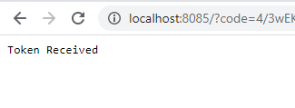

# Sample Node.js application that demonstrates use of [drive-appdata-client](https://github.com/drodimin/drive-appdata-client) package

## Setup
### 1. Clone The Repository

### 2. Provide Google OAuth Settings
To make use of this sample one needs to setup an application in the [Google Developer Console](https://console.developers.google.com/). 
Then create .env file in the project folder and copy credentials for the application:
```
CLIENT_ID=Client Id Of Your App
CLIENT_SECRET=Client Secret ot Your App
REDIRECT_URIS=http://localhost:8085
```
### 2. Install npm packages
> npm install

## Run the sample
> node index.js

*If there is no saved token (tokens.json file) in the project folder or the token has expired, you will be presented a link to obtain the token:*
```
PS C:\Dev\drive-appdata-client-app> node index.js
CLick link to obtain access token: https://accounts.google.com/o/oauth2/v2/auth?access_type=offline&scope=https%3A%2F%2Fwww.googleapis.com%2Fauth%2Fdrive.appdata%20https%3A%2F%2Fwww.googleapis.com%2Fauth%2Fuserinfo.email&prompt=consent&response_type=code&client_id=...
```
*Click on the link. A browser will open and standard Google prompts will be shown: To select an account and to give permissions to the application. Upon user approval of the prompts the application will listen on port 8085 to receive an access code which it will then exchange for an OAuth token. The token will be saved to a file and these steps will not need to be repeated on consequent runs. Once you see the following result, you can close the browser and return to the terminal in which you are running the application:* 



Now a user signed in to Google and gave permissions for the application to manage its own configuration in user's Google drive. The user's drive will now contain a special folder for the application where application can save and read files. 

[drive-appdata-client npm package](https://github.com/drodimin/drive-appdata-client) provides methods for performing following operations:

## Create File
```
Enter command [quit|find|list|update|delete|create|get]:create
Enter file name to create: my-sample-data.json
Enter JSON data for new file with or press ENTER to go with the default {"test":"1"}: {"mynumber":12345"}
Update file my-sample-data.json
{ id: '1CkQnohHfkOrWQXGZl_9yUlDIDl3zpgA1viCeGSJGql6EghPyjQ' }
```
*Now you have file id which uniquely identifies a file in Google Drive and can be used in subsequent commands*

## Find File
*You can find a file by name*
```
Enter command [quit|find|list|update|delete|create|get]:find
Enter filename to find: my-sample-data.json
Find file my-sample-data.json
1 files found
[
  {
    id: '1CkQnohHfkOrWQXGZl_9yUlDIDl3zpgA1viCeGSJGql6EghPyjQ',
    name: 'my-sample-data.json'
  }
]
```
*This command also returns file id which uniquely identifies a file in Google Drive and can be used in subsequent commands*

## List Files
*You can list all the files in the appdata folder*
```
Enter command [quit|find|list|update|delete|create|get]:list
List all files
2 files found
[
  {
    id: '1CkQnohHfkOrWQXGZl_9yUlDIDl3zpgA1viCeGSJGql6EghPyjQ',
    name: 'my-sample-data.json'
  },
  {
    id: '1ENa3SsQyb1a6dG_GBzJaRAXfXL2j58aIMKZqi72nZwtz0tt7fQ',
    name: 'test.json'
  }
]
```
*This command also returns file id which uniquely identifies files in Google Drive and can be used in subsequent commands*

## Update File
* Update file command will update file content and it takes file id as an argument.*
```
Enter command [quit|find|list|update|delete|create|get]:update
Enter file id to update (can be found by calling find command): 1CkQnohHfkOrWQXGZl_9yUlDIDl3zpgA1viCeGSJGql6EghPyjQ
Enter JSON data to update file with or press ENTER to go with the default {"test":"1"}: {"newnumber": "4567"}
Update file 1CkQnohHfkOrWQXGZl_9yUlDIDl3zpgA1viCeGSJGql6EghPyjQ
{
  kind: 'drive#file',
  id: '1CkQnohHfkOrWQXGZl_9yUlDIDl3zpgA1viCeGSJGql6EghPyjQ',
  name: 'my-sample-data.json',
  mimeType: 'application/json'
}
```

## Delete File
* Delete file command will delete a file and it takes file id as an argument.*
```
Enter command [quit|find|list|update|delete|create|get]:delete
Enter file id to delete (can be found by calling find command): 1CkQnohHfkOrWQXGZl_9yUlDIDl3zpgA1viCeGSJGql6EghPyjQ
Delete file 1CkQnohHfkOrWQXGZl_9yUlDIDl3zpgA1viCeGSJGql6EghPyjQ
```

## Get File
*Get file command will return the content of a file and it takes file id as an argument.*
```
Enter command [quit|find|list|update|delete|create|get]:get
Enter fileId: 1CkQnohHfkOrWQXGZl_9yUlDIDl3zpgA1viCeGSJGql6EghPyjQ
Getting file 1CkQnohHfkOrWQXGZl_9yUlDIDl3zpgA1viCeGSJGql6EghPyjQ
{ newnumber: '4567' }
```
